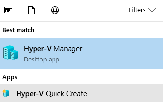
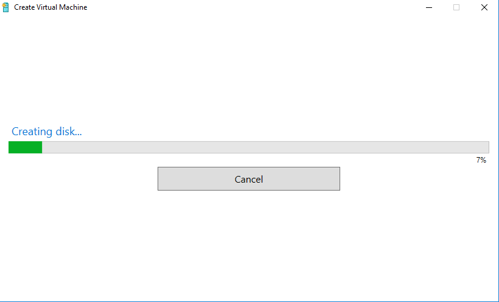

# Hyper-V

Hyper-V is a tool that allows Windows to function as a Type 1 hypervisor,
in a roughly analagous way to [KVM](https://www.linux-kvm.org/page/Main_Page) on Linux platforms.

The following Windows variants support Hyper-V:

* Windows 10 Pro & Enterprise
* Windows 8 Pro & Enterprise
* Windows Server (R2 2008 and up)

## Enabling Hyper-V

Run the following command via a Powershell 5.1 <sup>&dagger;</sup> terminal as Administrator:

&dagger; <sub>Shell versioning _does_ matter in this case. Powershell Core 6.0 will not work.</sub>

```shell
Enable-WindowsOptionalFeature -Online -FeatureName Microsoft-Hyper-V -All
```

## Creating VMs

Once Hyper-V support has been enabled two programs will be available;
"Hyper-V Quick Create" and "Hyper-V Manager".



"Hyper-V Quick Create", as the name implies, is the fastest way to start-up a new VM.
VMs can be provisions from local `.iso` disk images, `.vhd`/`.vhdx` virtual hard drives,
or via a Hyper-V gallery item (which will be discussed later).


After selecting a virtual machine and hitting "Creation Virtual Machine" a VM will
be kicked off.



After the VM is successfully started, it can be connected to directly from the
Quick Create tool.


## Managing Existing VMs

Hyper-V Manager allows us to manage VMs that were created previously, either on
our local machine or on a remote server.

In order to control previously created local VMs we will need to open Hyper-V Manager
with Admin rights.


To use Hyper-V Manager we will need to connect to a Hyper-V server. For the most
part this will be our local machine &mdash;in this case we will use
"Actions"&rarr; "Hyper-V Manager"&rarr;"Connect To Server..." and select "Local Computer".


## Free-ish Windows Images for Testing

One issue (not exclusive to Hyper-V) with using Windows guest machines is
that each guest OS will require it's own license. This can make small-scale testing
quite fiddley and somewhat expensive.

However there are a few free-ish options for Windows VM development images.

* [Windows 10 Enterprise Developer Environment](https://developer.microsoft.com/en-us/windows/downloads/virtual-machines)
* [Windows Internet Explorer/Edge Dev Images](https://developer.microsoft.com/en-us/microsoft-edge/tools/vms/)
* [Windows Server Enterprise 2008 R2](https://www.microsoft.com/en-us/download/details.aspx?id=2227)

Most of theses images have an evaluation license that expires after some number of days
(90 or 180 usually).
It should be noted that these images can be re-downloaded after their temporarily
license expires, but this approach is not particularly suitable for production work.
